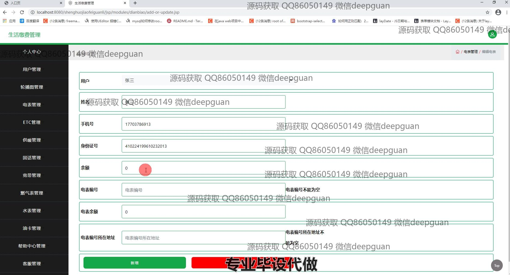
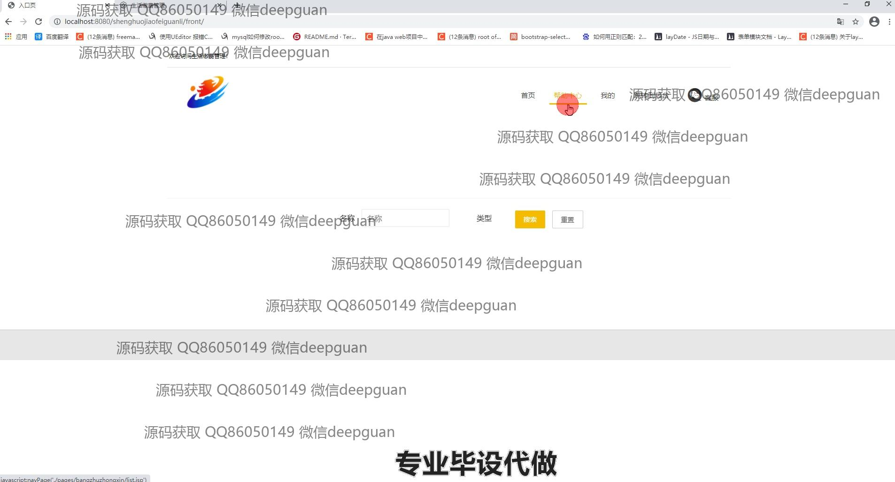

<h1 align="center">生活缴费系统及相关安全技术的设计与实现</h1>

## 简介
生活缴费管理系统：通过集中管理，实现电表、ETC、供暖等多种费用的在线缴纳和用户信息管理，提供用户友好的界面和多种支付方式。    --计算机毕业设计源码；毕设源码；java毕业设计源码

## 联系方式

<h3 align="center">获取完整代码与数据库文件 + 微信：deepguan QQ: 86050149 QQ群: 783742310</h3>

<h3 align="center">可帮忙远程部署 包运行成功！提供远程部署、修改代码、设计文档指导、代码讲解等服务！</h3>

## 功能介绍（完整见运行截图）
管理员：登录系统后，管理员可进行用户信息管理，包括查询、添加、修改和删除用户。系统支持电表、ETC、燃气、水表、油卡等多种缴费项目的管理，管理员可以设置相关参数、管理账单记录和操作日志。帮助中心模块中，管理员能编辑帮助信息、处理用户询问及回复。此外，管理员可管理数据库，支持字典数据的增删改查，优化用户分类和信息检索。

用户：用户登录后可在系统中查看和管理个人缴费信息，包括电表、燃气以及ETC等服务项目。用户可以查询历史缴费记录，使用系统提供的多种支付方式进行在线缴费。个人信息及联系方式均可进行查看和修改，同时用户具备权限来查看拥有设备的详细状态。帮助中心提供对应用问题及解决方案的搜索和查询，支持用户在使用过程中得到及时支持和引导。

## 运行截图

本代码来源于网络,仅供学习参考使用!

